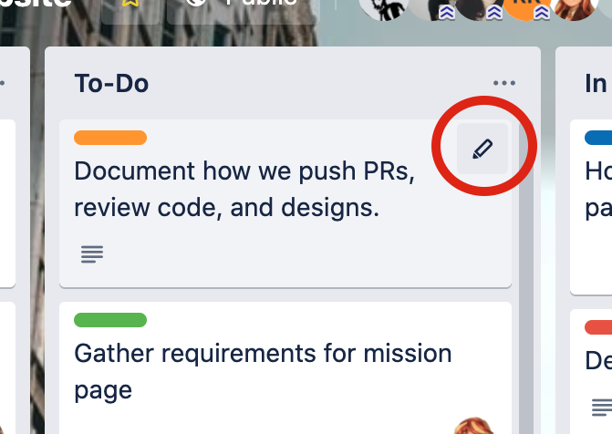
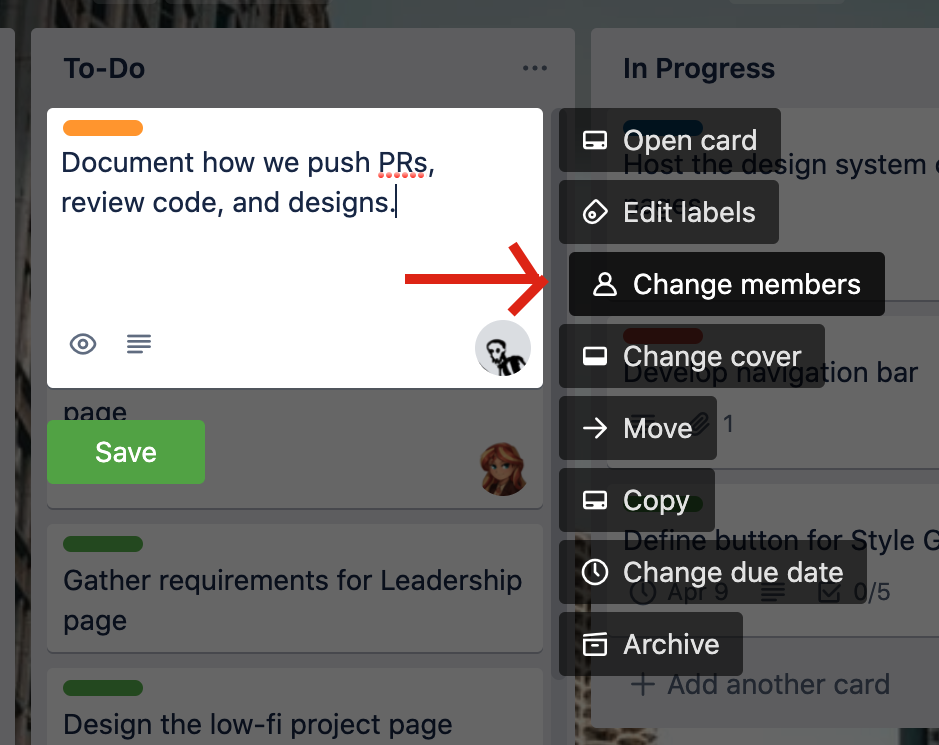
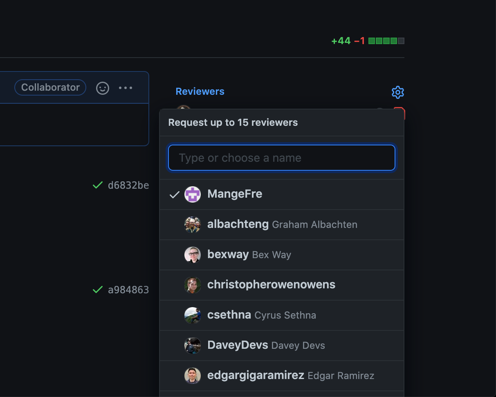

# How to Contribute to the Voma Project
Here are steps to guide you through the process of contributing to the Voma back end project. 

1. Find a Trello card in the [meta projects trello](https://trello.com/b/R9csrAIP/meta-projects) "To-Do" column you want to take on (they should be labeled [Voma][BE]). Assign your name to it by clicking the pencil icon in the top right of the card when you hover over it. 



Click "Change Member" and add yourself. 




2. Move the card to the "In Progress" Column. 

3. Make a new branch. ```git checkout -b <branch-name>``` Usually the branch name is named after the feature you are adding.

4. Do your coding magic. 

5. When you are ready to commit the changes; in your terminal type
``` git add -A``` to stage your changes and ```git commit -m "<Message on what changes you've made>"``` to make the commit. 
If this is the first commit you've made to this branch you will need to type ```git push --set-upstream origin <branch-name>```
Otherwise if you've already set the upstream you can just enter ```git push```

6. Once you are ready to open a pull request go to https://github.com/Code-For-Chicago/Voma-backend and if you are lucky there will be a yellow notice offering you to "Compare & pull request".

If it's not there you can go to the "Pull Requests" tab at the top, click the green "New Pull Request" button, and select your branch in the right branch dropdown. Then click "Create Pull Request"


7. You should get a green checkmark saying "Able to Merge".

If you are not able to merge, then you'll need to merge the main branch into your branch and solve any merge conflicts.

8. Add a link to the trello ticket in the notes and click "Create pull request". 

9. Move the Trello card from "In Progress" to "Code Review".

10. You will need to post in the 'meta-development' slack channel informing the rest of the team you've made a pull request. Something like "PR ready for review: \<link to github pull request\>".

Additionally in the GitHub pull request, you can add reviewers by clicking the gearbox next to the "Reviewers" section on the right. 


11. Sometimes a reviewer will see changes that need to be made. They may write notes on what you should fix. Repeat steps 4-10 if changes are requested. 

12. Once your changes are approved, then you are ready to merge your branch! Go ahead and merge to main. If you have any merge conflicts, you'll need to resolve those first.